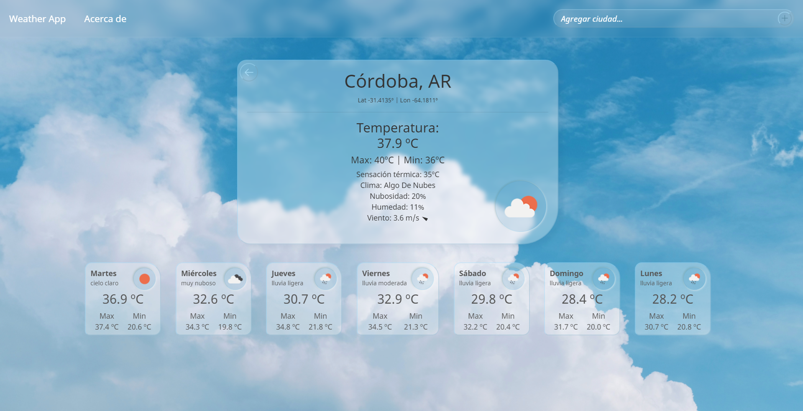
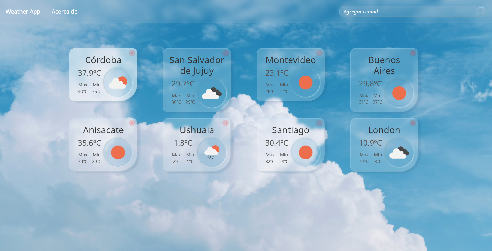

> Franco Aparicio
# Weather App

Techs: Javascript | HTML | CSS | React

##### *español*
*¿Quieres saber qué temperatura hace en tu ciudad y en cualquier parte del mundo?* Escribe los nombres de las ciudades que quieras en la barra de búsqueda y se generará una tarjeta por cada una de ellas. *¿Quieres ver más detalles, y el pronóstico extendido de la semana?* Clickea en cualquiera de las tarjetas para ampliar la información del clima de esa ciudad. — WeatherApp es una aplicación de página única (React SPA) creada por Franco Aparicio, alumne del bootcamp <a href='https://www.soyhenry.com'>soyHenry</a>. La aplicación brinda información del clima en tiempo real (extraída de <a href='https://openweathermap.org/api'>API de openweathermap</a>) de cualquier ciudad del mundo.

##### *english*
*Would you like to know how's the weather like in your city? or any city in the world, actually!* Just type in their names in the search bar above, and you'll get a card for each one of them showing the main information. *Would you like to see more details, along with the nwxr week forecast?* Click in any of your city-cards to expand the weather information of that city. — WeatherApp is a React single-page app created by Franco Aparicio, student of <a href='https://www.soyhenry.com'>soyHenry</a>'s bootcamp. The app offers real-time weather information (withdrawn from <a href='https://openweathermap.org/api'>openweathermap's API</a>) of any city in the world.

<!-- ## Instructions

on WeatherApp directory:  
`npm install` to install dependencies  
`npm start` to compile and mount  
enjoy!

 -->

JULIO / AGOSTO — 2021

